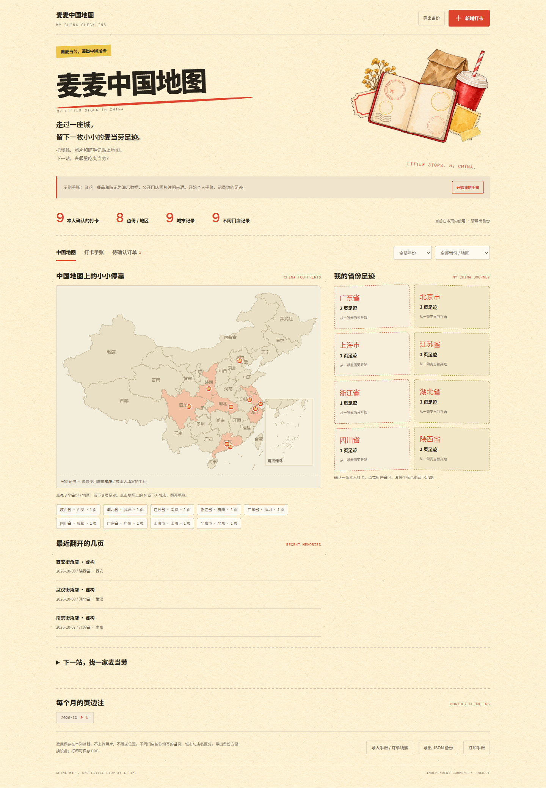
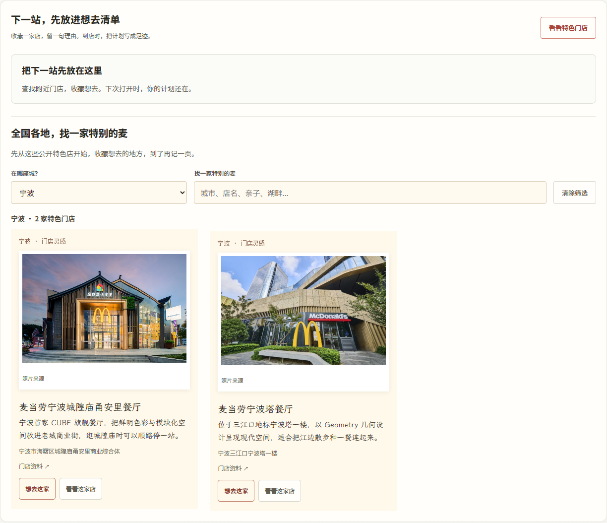
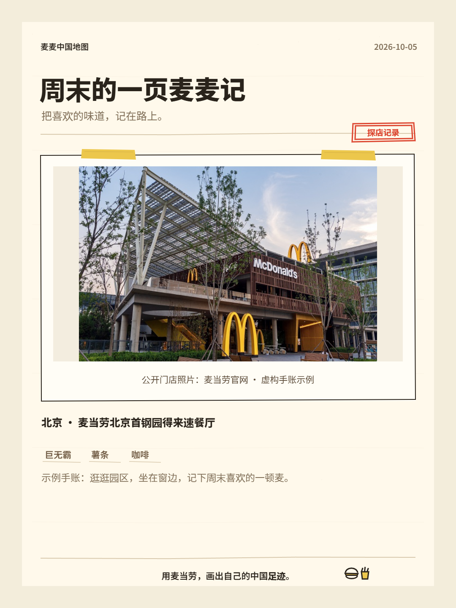
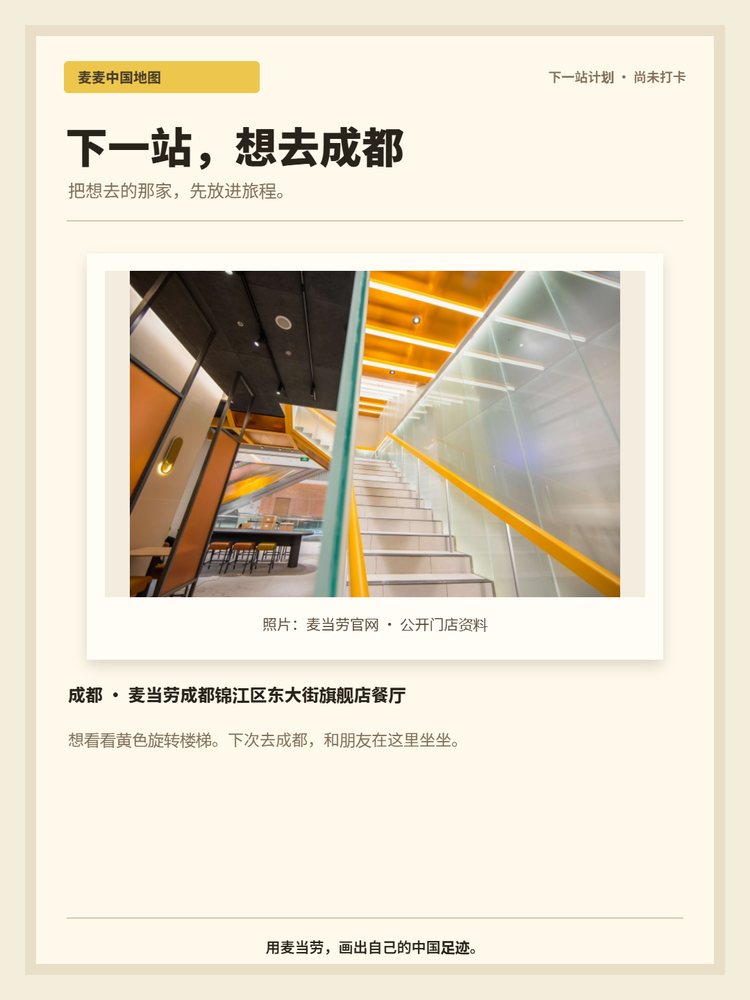

# 麦麦中国地图

**用麦当劳，画出自己的中国足迹。**

把探店时吃过的餐品、拍下的照片和随手记，贴到一张属于自己的中国地图上。走过一座城，留下一枚小小的麦当劳足迹。

**[下载 Windows 完整体验包](https://github.com/Jay1023CN/mcd-china-map/releases/latest)** · [参赛作品](https://github.com/M-China/mcd-developer-innovation-challenge/issues/139) · [宣传文案与配图](docs/GROWTH.md)




## 打开就能记

1. 从 [Releases](https://github.com/Jay1023CN/mcd-china-map/releases) 下载 Windows 完整压缩包并解压。
2. 双击 `启动.cmd`，浏览器打开 <http://127.0.0.1:8765/>。
3. 点击“新增打卡”，选择省份，填写城市、门店、餐品，贴上照片和随手记。
4. 保存后点亮所在省份。点击地图上的 M 或城市标签，就能翻开这一页。
5. 点击“导出备份”保存 JSON；换设备时通过“导入”恢复。

保持启动窗口打开。普通手账无需 Python 或 Node.js；已安装 Python 3.10+ 时，启动器自动启用页面连接、门店查询和订单同步。

## 下一站，找一家麦当劳

还没连接 Token 也可以先逛“想去清单”：上海华旭、成都东大街、北京首钢园、广州天字码头、深圳光华，五家公开特色店的照片离线可看，一键收藏或带入下一次打卡。



点击页面上方“连接麦当劳”，粘贴自己的 [官方 MCP Token](https://open.mcd.cn/mcp)。展开“下一站，找一家麦当劳”，输入城市和地标，选择到店自取或得来速，即可查询官方附近门店并带入打卡表单。

门店查询和订单同步需要 Python 3.10 或更新版本。Token 仅留在运行进程中，不写入页面、配置或备份。

连接后点击“同步我的订单”，门店和餐品整理好后直接显示在“待确认订单”。核对自动带入的城市、省份，确认本人到店，就能留下一页足迹。此前在终端同步过的订单，点击“载入本机订单”即可显示。

仍保留 `启动门店查询.cmd` 隐藏输入 Token 和 `同步中国订单.cmd` 的终端用法。个人数据留在 `private`，不会覆盖公开首页和示例页。

同步会根据已核实的门店资料和名称自动补城市、省份与城市点位；已收录门店照片会直接带入，并附来源。你也可以上传自己的照片，替换默认显示，备份同时保留两种照片信息。

## 可以留下什么

- 中国分省地图：34 个省份／地区选项，按本人打卡点亮省份，带南海诸岛插图。
- 省份足迹与城市点位：支持年份、省份筛选，文字记录也可以收集足迹。
- 照片手账：新增、编辑、删除、查看详情，照片在浏览器内缩小并保存。
- 翻找回忆：城市、门店、餐品和随记搜索；详情中“再来这家”沿用门店和餐品，写成新的打卡。
- 官方附近门店：按城市和地标查询，查看名称、地址、营业状态和时间。
- 想去清单：收藏附近门店、写下想去的理由；到店后直接带入打卡表单，清单随 JSON 备份一起恢复。
- 分享下一站：把想去的门店、照片和理由做成计划卡，发给朋友一起安排；从想去清单点击“分享下一站”即可。
- 订单线索：通过麦当劳中国 MCP 整理历史订单，方便补充探店记录。
- 备份与打印：导出包含照片的 JSON，导入恢复，打印或保存 PDF。
- 足迹分享卡：纸色、红黄两种配色，1080 × 1440 图片；手机可调用系统分享面板，电脑可“复制图片”后直接粘贴到微信或 QQ，也可保存图片。
- 探店分享卡：点击手账的“分享这一页”，把照片、日期、餐品和随记排成一张卡片；可换标题、选择保留整张照片或裁切铺满，并开关门店与随记。
- 年度页边注：今年、本月记录，首站与最近一页、同月往年回顾，以及省市足迹纪念。
- 常出现的味道：从已确认手账整理餐品，点击就能翻回相关记录。

中国地图手账可以手动记录各省份／地区；官方 MCP 服务覆盖中国大陆，不含港澳台。查询结果是本次附近门店或近期订单范围。地图位置使用内置城市参考点或本人坐标，门店查询当前没有提供精确经纬度。




## 保存与示例

手账和想去清单保存在当前浏览器，没有云同步。请固定使用同一个浏览器和地址，并定期导出备份。最多 1000 条记录、100 家想去门店，处理后单张照片不超过 1.5 MiB、归档不超过 8 MiB。浏览器保存失败时仍可导出本页内容。

同一个浏览器多开页面时，新增和删除会自动同步；保存前合并其他窗口的新记录。导入已确认订单的备份时，可以升级本机同一条待确认线索。

遇到不顺手的地方，可以从页面底部打开[体验反馈](https://github.com/Jay1023CN/mcd-china-map/issues/new/choose)，页面底部同时显示使用版本。

[中国地图演示](docs/china-demo.html)使用虚构记录，首页从空白个人手账开始。旧版中国记录可恢复；旧版海外备份请保留在原版本中。

## 开发与验证

```powershell
py scripts/build_global_journal.py --output index.html
py scripts/build_global_journal.py --archive examples/china-journal.synthetic.json --output docs/china-demo.html
node --test tests/journal-engine.test.js
py -m unittest discover -s tests -p 'test_*.py' -v
py scripts/package_skill.py
```

`web/journal-engine.js` 负责归档和统计，`web/global-journal.js` 负责页面交互，`scripts/local_api.py` 提供本机只读门店查询。浏览器验收脚本为 `tests/browser-smoke.cjs`，GitHub Actions 在 Windows 执行检查。

[Skill](SKILL.md) · [MCP 接入](MCP_INTEGRATION.md) · [开发与文件管理](docs/DEVELOPMENT.md) · [产品与反馈](docs/PRODUCT-REVIEW.md) · [运行验证](docs/VALIDATION.md) · [素材来源](docs/SOURCES.md) · [参赛申请](https://github.com/M-China/mcd-developer-innovation-challenge/issues/139)

社区独立作品，非麦当劳官方产品。原创代码遵循 [MIT License](LICENSE)，第三方素材遵循各自许可。官方参赛声明保留原文。
