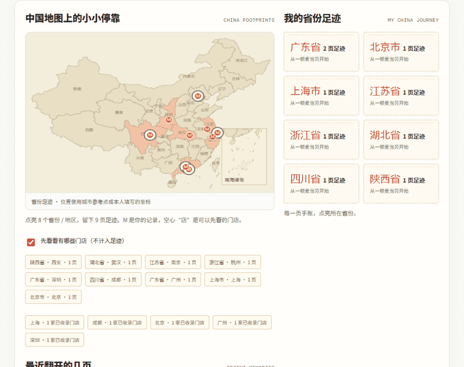
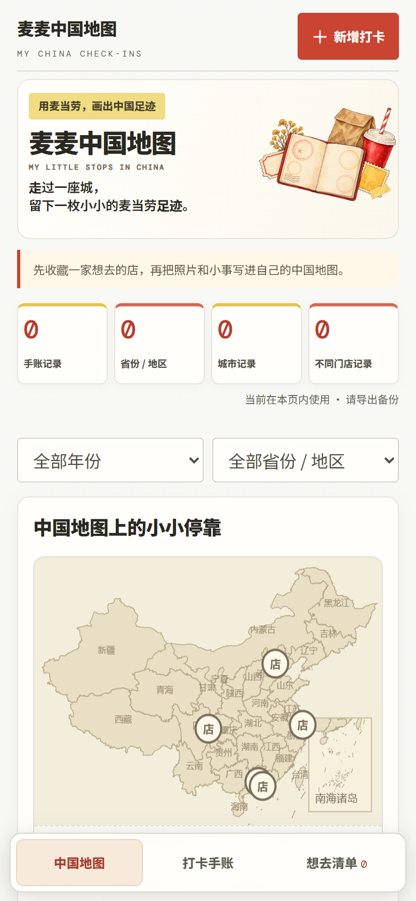
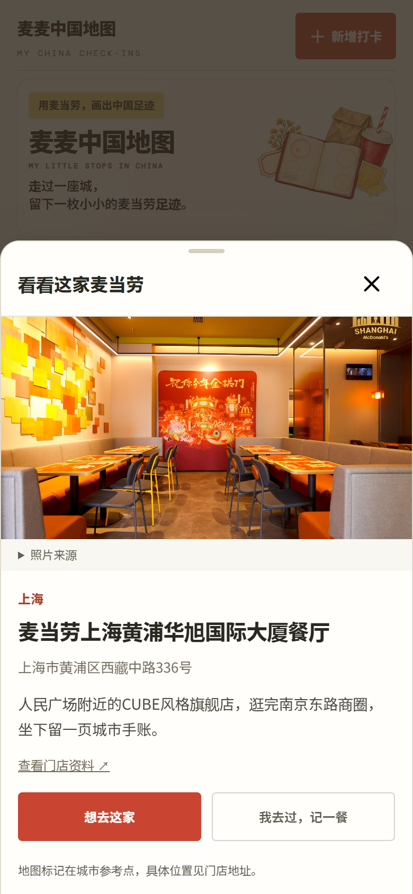
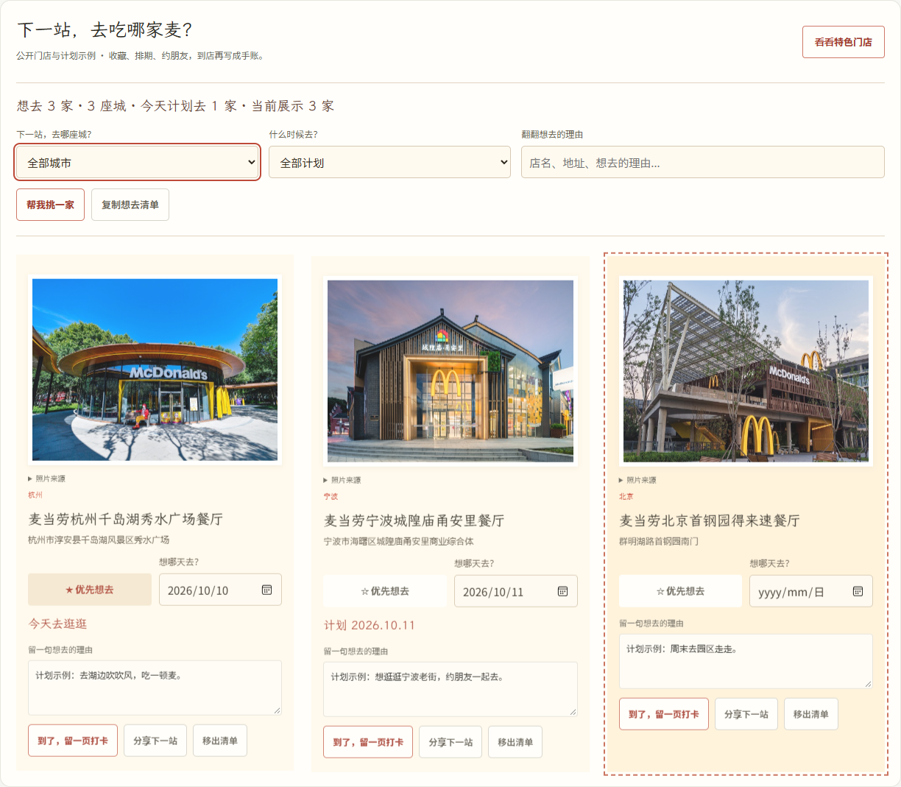

# 麦麦中国地图

<div align="center">

### 把麦当劳吃成一张中国地图

把探店时吃过的餐品、拍下的照片和随手记，贴到一张属于自己的中国地图上。

<a href="https://jay1023cn.github.io/mcd-china-map/"><strong>打开网页版</strong></a>　·　<a href="https://github.com/Jay1023CN/mcd-china-map/releases/latest">下载 Windows 完整体验包</a>　·　<a href="https://github.com/M-China/mcd-developer-innovation-challenge/issues/139">参赛作品</a>　·　<a href="docs/GROWTH.md">宣传素材</a>

<br>


</div>

## 走过一座城，留下一页麦麦记


<details>
<summary>看看地图、照片手账与分享卡</summary>



</details>

记下餐品、照片和当时的心情；地图标出走过的省份与城市，之后还能按城市、门店或餐品翻找。它是一个社区独立作品，个人资料保存在自己的浏览器里。

### 从一次探店开始

直接打开 [麦麦中国地图网页版](https://jay1023cn.github.io/mcd-china-map/)，就能写手账、加照片、点亮地图、收藏特色门店、生成分享卡，以及备份恢复和打印。无需安装，在电脑和手机浏览器里都可以使用。记录保存在当前浏览器，换设备前记得导出备份。

需要本机 MCP 门店查询和订单同步时，也可以下载本地包：

1. 从 [Releases](https://github.com/Jay1023CN/mcd-china-map/releases) 下载 Windows 完整压缩包并解压。
2. 双击 `启动.cmd`，浏览器会打开 <http://127.0.0.1:8765/>。
3. 点击“新增打卡”，填写城市、门店和餐品，再加照片与随手记。
4. 保存后点亮所在省份；点地图上的 M 或城市标签，打开对应手账。
5. 用“导出备份”保存 JSON，换设备时可导入恢复。

普通手账无需 Python 或 Node.js。保持启动窗口打开即可使用。默认地址被占用时，可双击 `备用启动.cmd`，改用 <http://127.0.0.1:18765/>；已有手账换地址后，通过 JSON 备份导入。

## 想去的店，先收藏起来

先逛 **19 座城市、28 家特色门店**：从天津老街、哈尔滨索菲亚，到银川、西宁，再到千岛湖、宁波江边、长沙童趣空间和福州烟台山。按城市选，也可以搜店名、亲子、湖畔、CUBE 等关键词；照片、地址和介绍都能点开看，喜欢就收进下一站。

全国地图将相近城市聚合展示门店数量，选中城市后展开照片标签。点地图、门店预览或照片都能打开介绍；手机从底部展开，可以收藏或带着默认照片记一餐，也能换成自己上传的照片。地图与门店手账共享筛选，切换页面继续找。

<p> </p>


### 下一站，去吃哪家麦？

收藏完，给想去的店标个优先级、选个探店日期。想安排旅行，就按城市翻清单；想看看近期计划，就切到“今天”或“未来 7 天”。店名、地址和你留下的理由都能搜。

拿不定主意时点“帮我挑一家”，连续点会换一家；也能把当前清单复制给朋友，约着一起去。日期和优先标记随 JSON 备份保存，计划分享卡带上出发日期。到了店，直接把收藏写成手账。



支持 Python 3.10 或更新版本时，可连接自己的 [官方 MCP Token](https://open.mcd.cn/mcp)，按城市和地标查询官方附近门店，也可同步近期订单。查询结果可带入打卡表单；Token 只留在运行进程中，不写入页面、配置或备份。终端用户也可继续使用 `启动门店查询.cmd` 和 `同步中国订单.cmd`。

## 把订单整理成自己的手账

新版把已完成订单自动整理成可编辑的手账：门店、餐品、城市、省份和默认照片自动带入。想留下什么由你决定，可以改随记、换自己的照片，也可以删除。删掉的订单记录在刷新或再次同步后不会重新出现。

GitHub Pages 网页版现已提供地图和手账功能。网页中的 Token 登录、官方门店查询和订单同步将在服务器接入后开放；现在可通过本机网页服务使用，支持 Windows、Linux 和 macOS，见 [网页版使用与部署](docs/WEB.md)。当前下载链接对应的安装包版本以 Release 页面为准。

## 分享一页，或约下一站

打卡可以生成探店分享卡；想去清单可以生成计划卡，发给朋友一起安排。设备支持时可调用系统分享面板；电脑可复制图片后粘贴到微信或 QQ，也可保存图片。

<table>
  <tr>
    <td align="center"><br><strong>探店分享卡</strong></td>
    <td align="center"><br><strong>下一站计划卡</strong></td>
  </tr>
</table>

分享卡像一页旅行手账：圆笔黑红标题、原始门店照片、城市记号和随记自然排在同一张纸上，食品小插画与蓝笔注记相连。支持编辑标题、选择照片全图或裁切，并决定是否保留门店和随记。示例中的记录和门店照片用于公开演示。

## 还可以做什么

- **地图足迹：** 34 个省份／地区选项，按自己的打卡点亮；支持年份和省份筛选，也可只写文字记录。
- **找回旧记录：** 搜索城市、门店、餐品和随记；点“再来这家”可沿用门店与餐品新建记录。
- **整理味道与回忆：** 年度和月度记录、首站与最近一页、往年回顾，以及常点餐品回看。
- **备份与打印：** 导出包含照片的 JSON，导入恢复；打印或保存为 PDF。
- **手机记录：** 页面适配移动屏幕，可从手机照片中选图并生成分享卡。

地图位置采用内置城市参考点或本人填写的坐标；官方附近门店查询不提供精确经纬度。MCP 服务覆盖中国大陆，不含港澳台。手账和想去清单都保存在当前浏览器，没有云同步；建议固定使用同一浏览器和地址，并定期备份。最多保存 1000 条记录、100 家想去门店；处理后的单张照片不超过 1.5 MiB，完整归档不超过 8 MiB。

## 试用与反馈

[打开麦麦中国地图网页版](https://jay1023cn.github.io/mcd-china-map/) · [提交体验反馈](https://github.com/Jay1023CN/mcd-china-map/issues/new/choose) · [查看素材来源](docs/SOURCES.md)

旧版中国记录可恢复；旧版海外备份请保留在原版本中。

## 开发

```powershell
py scripts/build_global_journal.py --output index.html
node --test tests/journal-engine.test.js
py -m unittest discover -s tests -p 'test_*.py' -v
py scripts/package_skill.py
```

`web/journal-engine.js` 负责归档和统计，`web/global-journal.js` 负责页面交互，`scripts/local_api.py` 提供本机门店查询。浏览器验收脚本为 `tests/browser-smoke.cjs`，GitHub Actions 在 Windows 执行检查。更多信息见 [Skill](SKILL.md)、[MCP 接入](MCP_INTEGRATION.md)、[开发与文件管理](docs/DEVELOPMENT.md)、[运行验证](docs/VALIDATION.md) 和 [参赛申请](https://github.com/M-China/mcd-developer-innovation-challenge/issues/139)。

社区独立作品，非麦当劳官方产品。原创代码遵循 [MIT License](LICENSE)；第三方图片等素材依照各自来源和许可使用。官方参赛声明保留原文。
