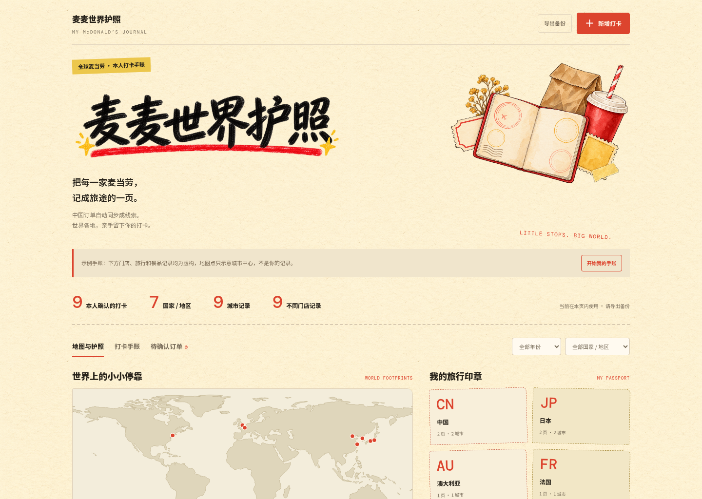

# 麦麦世界护照

**把世界各地的一餐，写成你自己的手账。**

面向喜欢旅行、记录餐品与收集印章的用户，由社区独立开发，非麦当劳官方产品。

手绘纸张、旅行护照和国家 / 地区印章，配上地图、照片与餐品记录。这是在 Windows 本地运行的个人打卡原型：入口从空白手账开始，中国大陆订单作为待本人确认的线索，海外记录由本人手动填写。



> 图片及 `docs/global-demo.html` 使用虚构旅行、门店与餐品数据，仅展示界面。`index.html` 不预填这些记录。

## Windows 打开就能记

从 [GitHub Releases](https://github.com/Jay1023CN/mcd-world-passport/releases) 下载完整 Windows 压缩包并解压。

1. 将完整项目文件夹放到 `D:\coding\麦当劳\麦麦世界护照`。
2. 双击 **`启动.cmd`**。它使用 Windows PowerShell 启动本地 HTTP 服务，无需 Python。
3. 浏览器打开 **<http://127.0.0.1:8765/>**。首次进入是空白个人手账。
4. 点击“新增打卡”，填写日期、国家 / 地区、城市、门店、餐品和随手记；确认本人到店后保存。
5. 点击“导出备份”，保存包含照片的 JSON 文件。换设备或浏览器时，用“导入”恢复。

启动窗口运行期间服务保持可用，关闭窗口会停止服务。建议固定使用同一浏览器及上述地址：其他端口、地址或浏览器拥有各自的存储。不要直接双击 HTML 文件作为日常入口。

## 护照可以记什么

| 功能 | 记录方式 |
| --- | --- |
| 世界打卡 | 249 个 ISO 国家 / 地区选项，城市与门店自由填写 |
| 国家 / 地区印章 | 统计本人确认的记录、城市与门店数量 |
| 地图 | 内置离线陆地轮廓；60 个常用城市参考位置，也可手填坐标或仅记文字 |
| 照片与随手记 | 照片在本浏览器处理，随 JSON 一起备份，不上传到图片服务 |
| 年份与国家筛选 | 查看某年或一个国家 / 地区的手账 |
| 中国订单线索 | 可选 MCP 查询，补齐城市并确认本人到店后才计入打卡 |
| 手账维护 | 新增、编辑、删除、查看详情、导入 / 导出、打印 |

内置位置是**城市中心参考位置，不是麦当劳门店坐标**。手填坐标由使用者提供。没有坐标的文字记录仍能获得印章。门店按“国家 / 地区 + 规范化城市名 + 门店名”去重，这是本人记录中的门店数，不是官方门店身份核验。

## 接入中国大陆订单

手工打卡不需要 Token。只有读取官方中国大陆 MCP 时需要联网、官方 Token 和 **Python 3.10 或更新版本**。

1. 安装 Python 3.10 或更新版本，确保 `py` 或 `python` 可在命令行运行。
2. 从 [官方 MCP 开放平台](https://open.mcd.cn/mcp) 获取自己的 Token。
3. 双击 **`同步中国订单.cmd`**，在终端隐藏输入 Token；程序不把 Token 写入文件。
4. 同步成功后，在主页点击“导入”，选择 `private\mcp\global-candidates.json`。
5. 在“待确认订单”逐条核对。外送、替别人点单或本人没有到店的订单不作为本人打卡。真正到过店的记录，补齐城市并勾选本人确认后保存。

接口覆盖范围由官方本次返回结果决定，**不能据此宣称取得全年完整订单或全球订单**。当前接入只提供中国大陆线索，其他国家 / 地区手动记录。

PowerShell 中也可以运行：

```powershell
cd 'D:\coding\麦当劳\麦麦世界护照'
py scripts\sync_footprints.py --prompt-token --order-offset +08:00
```

`+08:00` 明确解释原始无时区下单时间，请按实际数据核对。可选 `--with-benefits` 只读取中国大陆优惠券与活动结果到本地；护照主页目前不展示福利面板，也不自动领券或兑换。

[MCP 接入说明](MCP_INTEGRATION.md) · [官方工具目录](docs/MCP_TOOLS.md)

云端个人保险库的密钥不会自动进入 Windows 终端；本地使用上述隐藏输入方式即可。每次同步的原始响应独立保存在 `private\mcp\runs`，失败保留以前的响应和上次成功的候选文件。

## 数据与备份

- 手账使用浏览器 `localStorage`，**没有云同步、登录账号或跨设备自动恢复**。本地 HTTP 服务提供页面文件，不接收手账写入。
- JSON 备份包含手账与嵌入照片。清理网站数据、隐私窗口、换浏览器或空间不足，都可能影响持久保存；请定期导出。
- 浏览器保存失败时，记录可能只暂存在本页，请立即导出备份。
- 最多 1000 条记录，处理后每张照片不超过 1.5 MiB，归档不超过 8 MiB。浏览器自己的存储额度可能更低。
- 原始 MCP 响应只写入 `private\mcp`，可能含个人信息，不应公开。候选文件不含原始订单号、支付链接或 Token，仍属于私人记录。
- 删除手账记录不会取消或改变麦当劳订单。虚构示例与个人手账使用独立存储，不能混为真实到访。

## 开发入口

`web/journal-engine.js` 负责校验与统计，`web/global-journal.js` 负责交互。`scripts/build_global_journal.py` 将素材、地图与脚本内嵌为单个 HTML；它是可选开发工具，不是日常启动依赖。

```powershell
# 构建空白手账
py scripts\build_global_journal.py --output index.html

# 单独构建虚构演示
py scripts\build_global_journal.py --archive examples\global-journal.synthetic.json --output docs\global-demo.html
```

[Skill 流程](SKILL.md) · [来源与许可](docs/SOURCES.md) · [运行验证](docs/VALIDATION.md) · [参赛信息](docs/REGISTRATION.md)

2026-10-09 已在 Windows 完成页面构建、本地服务、独立浏览器交互与真实 MCP 只读联调；本次返回 10 条订单，生成 10 条未确认线索，不证明全年覆盖或本人到访。公开演示均为虚构数据；测试方式见运行验证。官方参赛声明保留原文件；原创代码与文档遵循 [MIT License](LICENSE)，字体、图标和地理数据遵循各自许可。
